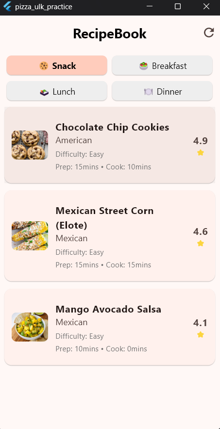
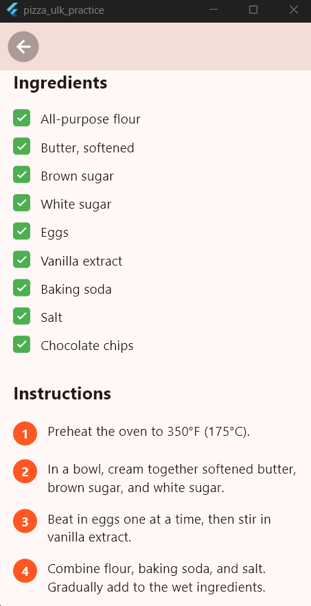

# pizza_ulk_practice

A mobile recipe application built for easy recipe discovery and cooking guidance.
Features

## Features

User Authentication: Secure login system with username/password
Recipe Categories: Browse recipes by Snack, Breakfast, Lunch, and Dinner
Recipe Discovery: View recipes with ratings, difficulty levels, and cooking times
Detailed Recipe View: Complete ingredient lists and step-by-step instructions
Recipe Ratings: 5-star rating system with user reviews
Cooking Information: Prep time, cook time, and serving size for each recipe

## Usage

Login with your credentials
Browse recipes by category
Select a recipe to view details
Follow the ingredients and instructions to cook

## API Integration

This app uses the DummyJSON API for recipe data and user authentication:

Base URL: https://dummyjson.com/
Endpoints Used:

/auth/login - User authentication
/recipes - Recipe data retrieval
/recipes/search - Recipe search functionality

## Technology Stack

Mobile application framework
User authentication system
Recipe database with ratings and reviews
DummyJSON API for backend data service

## Screenshots

